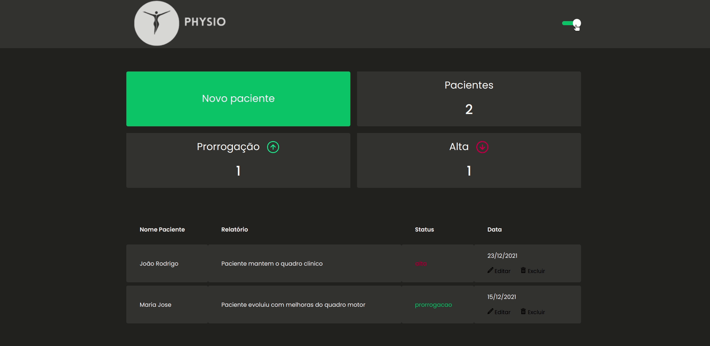

<h1 align=center>

</h1>

## 👨🏻‍💻 Sobre o Projeto

Nos últimos dias estive pensando em como desenvolver um projeto pessoal que colocasse meus conhecimentos em prática. Então criei <strong>Physio</strong>, que a ideia inicial é criar uma aplicação que armazena relatorios de entrada e saída de pacientes. Dentro da aplicação eu posso descrever os relatorios de prorrogação e alta e criar um histórico de todo o processo. Ainda em fase de construção, serão implementadas as funções de editar, excluir e login do Fisioterapeuta.

---



## 👨🏻‍💻 Tecnologias

- React
- Typescript
- Styled-components
- Axios
- Miagejs

---

## 💻 Instalação e uso

```
$ git clone https://github.com/jaquelinepires/physio.git
```

3. Vá para a pasta physio:

```
$ cd physio
```

4. Instale as dependêcias:

```
$ yarn
```

5. Agora, execute o aplicativo:

```
$ yarn start
```

Caso não abra automaticamente, acesse http://localhost:3000 para visualizá-lo no navegador.

---

Feito com 💙 by Jaqueline Pires
